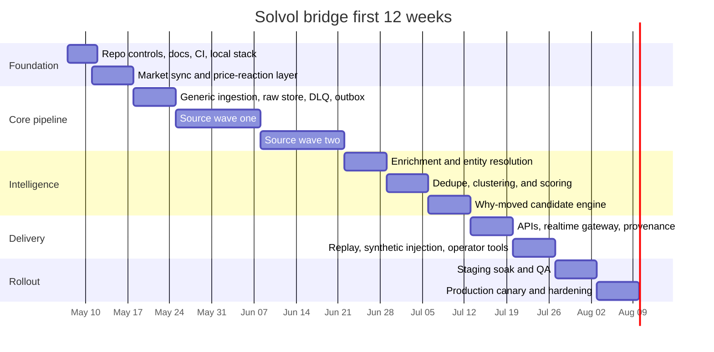

# Solvol Terminal Bridge Implementation Plan

> **For agentic workers:** REQUIRED SUB-SKILL: Use superpowers:subagent-driven-development (recommended) or superpowers:executing-plans to implement this plan task-by-task. Steps use checkbox (`- [ ]`) syntax for tracking.

**Goal:** Build the Solvol Terminal ingestion and processing bridge from the current read-only terminal foundation into a production-canary-ready, Polymarket-first event-correlation system.

**Architecture:** Polymarket public market data remains the authoritative market registry and price-reaction layer. External public/official/on-chain sources flow through deterministic adapters into immutable raw storage, normalized `NewsItem` documents, clustered `EventItem` objects, and auditable `WhyMovedCandidate` links with score breakdowns and provenance.

**Tech Stack:** Next.js App Router, React 19, TypeScript, npm, Node test runner, public Polymarket Gamma/CLOB/Data reads, Postgres/Timescale target schema, Redis-compatible queue/fanout target, S3-compatible raw payload storage, deterministic mock fallback.

---

## Executive Summary

The fastest path to a production-ready Solvol bridge is:

1. Lock the control plane, repo commands, CI expectations, and feature flags.
2. Make the Polymarket market registry and price-reaction layer authoritative.
3. Add a generic ingestion framework with source registry, cursors, raw payload metadata, idempotency, DLQ, and source health.
4. Integrate high-value official/open feeds first.
5. Add on-chain and secondary/lower-trust sources behind flags.
6. Harden enrichment, dedupe, event clustering, why-moved scoring, realtime delivery, replay, and rollout.

The acceptance bar is not just that the code runs. The bridge must be deterministic, replayable, observable, rate-limit safe, and able to produce auditable event-to-market links with explicit provenance.

This roadmap adapts the broader bridge plan to the current Solvol repo:

- Use `npm`, not `pnpm`, unless the repo intentionally migrates package managers.
- Keep all terminal source contracts in or aligned with `src/lib/terminal/types.ts`.
- Preserve the existing read-only Polymarket allowlist and mock fallback behavior.
- Continue using `SOLVOL_PLAN.md` as the execution log.
- Treat `guide.md` as the source architecture guide and this file as the execution roadmap.

## Primary Codex Goal Prompt

Use this from the Solvol repo root:

```text
/goal Implement the complete Solvol Terminal bridge described in /Users/vvv/Documents/solvol/guide.md and /Users/vvv/Documents/solvol/BRIDGE_IMPLEMENTATION_ROADMAP.md. Work in /Users/vvv/Documents/solvol. First read AGENTS.md, SOLVOL_PLAN.md, ARCHITECTURE.md, DATA_CONTRACTS.md, guide.md, and BRIDGE_IMPLEMENTATION_ROADMAP.md. Keep Solvol Terminal strictly read-only: do not add trade execution, order placement, custody, deposits, withdrawals, private-key handling, authenticated trading, or user fund flows. Preserve deterministic mock fallback so /terminal remains demoable without credentials. Treat public Polymarket Gamma/CLOB/Data reads as the authoritative market registry and price-reaction source. Treat LLM output as optional narration only; source truth must come from normalized data, raw source payload metadata, provenance, scores, rule IDs, and timestamps. Implement the roadmap in conservative milestones: control plane and repo commands; market registry and price reactions; generic ingestion framework; Tier A official/open source adapters; on-chain and secondary source adapters behind flags; enrichment, dedupe, event clustering, deterministic why-moved scoring; source-health/provenance APIs; realtime delivery; replay, synthetic injection, and operations docs. Update SOLVOL_PLAN.md whenever a milestone changes, verification is run, or a blocker appears. Run npm run lint, npx tsc --noEmit, node --test --experimental-strip-types test/*.test.ts, and npm run build before claiming the product foundation is ready. Continue autonomously until implemented, verified, documented, and ready for production canary, or until blocked by missing mandatory credentials, deployment access, or source policy/ToS constraints. Final response must summarize files changed, verification results, remaining blockers, rollout state, and any sources intentionally left mocked, disabled, or feature-flagged.
```

Fallback prompt if `/goal` is unavailable:

```text
Build the Solvol Terminal bridge end to end using /Users/vvv/Documents/solvol/guide.md and /Users/vvv/Documents/solvol/BRIDGE_IMPLEMENTATION_ROADMAP.md. Do not stop at planning. Keep the terminal read-only and preserve deterministic mock fallback. Implement the market registry and prices/reaction layer first, then the generic ingestion framework, then Tier A source adapters, then enrichment/dedupe/scoring, then why-moved correlation, then realtime serving and ops tooling. Maintain SOLVOL_PLAN.md as the execution log, run verification after each milestone, and pause only if mandatory credentials, deployment access, source policy constraints, migration/data-corruption risk, or replay nondeterminism blocks safe progress.
```

## Success Criteria

| Area | Acceptance criterion |
| --- | --- |
| Market foundation | Active markets sync continuously; price history backfill works; live market updates reach storage and APIs with bounded lag |
| Source ingestion | At least four Tier A external sources run in staging with source-health telemetry, resumable cursors, retries, and dead-letter handling |
| Provenance | Every normalized item points to immutable raw payload metadata and adapter version; every why-moved candidate exposes score breakdown and evidence links |
| Determinism | Replay of a fixed raw fixture window reproduces identical normalized IDs, event clusters, and candidate scores within defined tolerance |
| Dedupe and clustering | Duplicate collapse works across same-URL, same-headline, and near-duplicate copies; manual sample review is acceptable before canary |
| Correlation | Why-moved candidates exist for active markets, expose confidence and contradictory evidence, and degrade to “insufficient evidence” when support is weak |
| Realtime | UI-facing APIs and SSE/WebSocket fanout deliver new events, source-health changes, and updated candidates |
| Operability | Dashboards, alerts, runbooks, feature flags, and backfill/replay commands exist before production canary |
| Release readiness | Seven-day staging soak passes; production canary runs behind flags with rollback path and no unresolved P1/P2 defects |

## Stop and Pause Conditions

| Condition | Action |
| --- | --- |
| Missing mandatory infrastructure credentials | Finish all mock/replay-capable local work, then emit exact missing inputs |
| Source ToS or access ambiguity | Pause only the affected adapter and continue the rest of the bridge |
| Repeatable migration failure or data corruption risk | Stop rollout and fix migration/data safety before continuing normalized writes |
| Replay non-determinism above tolerance | Pause canary readiness until replay is deterministic |
| Rate-limit or IP-block incident on a public source | Auto-disable the source behind a flag, degrade gracefully, and continue with remaining sources |
| Why-moved false-positive rate too high in staging | Pause promotion of explanation cards; continue ingest/storage and add regression fixtures |

## Planned File Map

These are expected implementation targets. Keep exact paths aligned with existing code when the repo already has a local pattern.

| Path | Responsibility |
| --- | --- |
| `src/lib/terminal/types.ts` | Shared terminal contracts: source classes, raw provenance, `NewsItem`, `EventItem`, `WhyMovedCandidate`, source health |
| `src/lib/terminal/scoring.ts` | Deterministic scoring, correlation, sentiment/credibility rules, market reaction helpers |
| `src/lib/terminal/source-*` modules | Existing or new source adapters behind terminal source boundaries |
| `src/lib/polymarket/public-api.ts` | Public read-only Polymarket URL allowlist and endpoint metadata |
| `src/lib/polymarket/links.ts` | Verified event/source link behavior |
| `src/lib/bridge/*` | Generic ingestion framework, cursors, raw metadata, idempotency, replay, DLQ, outbox |
| `src/app/api/bridge/*` | Source health, latest events, why-moved, provenance, replay/backfill status APIs |
| `src/components/terminal/*` | UI surfaces for source health, why-moved cards, provenance, replay/operator panels |
| `test/*bridge*.test.ts` | Contract, pipeline, replay, source adapter, and synthetic injection tests |
| `supabase/schema.sql` or migrations | Tables for source registry, cursors, raw docs, normalized items, clusters, prices, candidates, outbox |
| `.env.example` | Public and server-only env inventory without secrets |
| `SOLVOL_PLAN.md` | Running execution log, verification results, blockers, and next steps |
| `docs/terminal-bridge-agent-ownership.md` | Prompt-to-artifact ownership matrix for the requested bridge agent roles |
| `guide.md` | Architecture guide for the bridge |
| `BRIDGE_IMPLEMENTATION_ROADMAP.md` | This implementation roadmap |

## Milestones

### Milestone 1: Foundation and Repo Controls

**Scope:** Control plane, local execution discipline, CI expectations, source registry foundations, and feature flags.

**Deliverables:**

- [x] Confirm repo package manager remains `npm`.
- [x] Add or update `.env.example` with bridge variables grouped by market, DB, queue, object store, source keys, observability, and flags.
- [x] Add source registry seed data for Polymarket, GDELT, SEC, Federal Reserve RSS, USGS, FEMA/CISA, Ethereum RPC, Etherscan, CoinGecko, Reddit, Mastodon, GNews, and mediastack.
- [x] Add feature flag names:
  - `bridge.ingest.source.<id>`
  - `bridge.cluster.v1`
  - `bridge.correlation.whyMovedV1`
  - `bridge.realtime.sse`
  - `bridge.ui.provenancePanel`
  - `bridge.social.lowTrustSources`
- [x] Add structured source-health model and local mock status data.
- [x] Keep terminal read-only tests proving no private/trading Polymarket paths are allowed.
- [x] Add a prompt-to-artifact ownership matrix for the requested bridge agent roles.
- [x] Record every completed command in `SOLVOL_PLAN.md`.

**Verification:**

```bash
npm run lint
npx tsc --noEmit
node --test --experimental-strip-types test/*.test.ts
npm run build
```

### Milestone 2: Market Registry and Price-Reaction Layer

**Scope:** Polymarket public market registry, price history, live updates, and reaction-window helpers.

**Deliverables:**

- [x] Keep public Polymarket reads routed through `src/lib/polymarket/public-api.ts`.
- [x] Sync active markets and event metadata into a market registry model.
- [x] Preserve verified event slugs and search fallback behavior for frontend/source links.
- [x] Store price snapshots or price history in a `market_price` model.
- [x] Add public market WebSocket checkpoint normalization for unauthenticated CLOB market updates.
- [x] Add reaction-window helpers that answer “what changed before/after this event time?”
- [x] Add tests for idempotent market sync, price ordering, market stream checkpoints, and reaction-window math.
- [x] Add source health for the market adapter.

**Verification:**

```bash
node --test --experimental-strip-types test/polymarket-public-api.test.ts
node --test --experimental-strip-types test/terminal-data.test.ts test/market-intel.test.ts
npm run lint
npx tsc --noEmit
```

### Milestone 3: Generic Ingestion Framework

**Scope:** Make ingestion source-agnostic before adding more feeds.

**Deliverables:**

- [x] Add `SourceAdapter`, `FetchCursor`, and `FetchBatch` contracts in or aligned with `src/lib/terminal/types.ts`.
- [x] Add raw document metadata with immutable checksum, source ID, external ID, fetched timestamp, adapter version, and raw blob key.
- [x] Add deterministic idempotency helpers.
- [x] Add cursor persistence boundary with support for `etag`, `lastModified`, `sinceIso`, `after`, `page`, and `blockNumber`.
- [x] Add normalizer runner that emits `NewsItem` rows.
- [x] Add DLQ model for failed raw items and failed normalization.
- [x] Add outbox model for downstream fanout.
- [x] Add replay command or test helper that rebuilds normalized items from fixtures.

**Verification:**

```bash
node --test --experimental-strip-types test/*source*.test.ts
node --test --experimental-strip-types test/*bridge*.test.ts
npx tsc --noEmit
```

### Milestone 4: Tier A Official and Open Sources

**Scope:** Add highest-value public sources before social or secondary commercial APIs.

**Source order:**

1. GDELT.
2. SEC EDGAR/RSS.
3. Federal Reserve RSS.
4. USGS real-time feeds.
5. FEMA/IPAWS or CISA official feeds.

**Deliverables per source:**

- [x] Adapter with `fetchBatch`, `normalize`, idempotency key, and `healthCheck`.
- [x] Cursor support and per-source rate-limit budget.
- [x] Shared runner retry/backoff handling with HTTP status and rate-limit metadata carried into source health.
- [x] Golden raw fixture coverage.
- [x] Fixture-to-`NewsItem` tests.
- [x] Failure-tolerant fallback so source errors do not break `/terminal`.
- [x] Source health visible through API and terminal UI.

**Verification:**

```bash
node --test --experimental-strip-types test/source-connectors.test.ts test/source-ingestion.test.ts
npm run lint
npx tsc --noEmit
```

### Milestone 5: On-Chain and Secondary Sources

**Scope:** Add crypto/on-chain context and lower-trust sources behind feature flags.

**Source order:**

1. Ethereum JSON-RPC raw logs.
2. Etherscan indexed API.
3. CoinGecko context.
4. Reddit OAuth API.
5. Mastodon public/federated APIs.
6. GNews.
7. mediastack.
8. Fact-check overlays.

**Rules:**

- [x] Keep JSON-RPC raw logs separate from Etherscan indexed enrichment.
- [x] Do not make Etherscan correctness-critical.
- [x] Keep social/news secondary sources disabled or low-trust by default.
- [x] Require corroboration before social-only signals become visible why-moved cards.
- [x] Add tombstone/deletion handling where source policy requires it.

**Verification:**

```bash
node --test --experimental-strip-types test/source-connectors.test.ts
node --test --experimental-strip-types test/*bridge*.test.ts
npx tsc --noEmit
```

### Milestone 6: Enrichment, Dedupe, and Why-Moved Engine

**Scope:** Deterministic intelligence layer.

**Deliverables:**

- [x] Timestamp normalization preserving source timestamps and UTC normalized values.
- [x] Entity aliases for market terms, people, organizations, tickers, tokens, places, forms, and contracts.
- [x] Geo extraction from structured fields and explicit coordinates before source-country fallback.
- [x] Deterministic sentiment and credibility scoring.
- [x] Canonical URL normalization.
- [x] Headline/body fingerprints.
- [x] Near-duplicate text matching.
- [x] Event clustering from `NewsItem` members.
- [x] Replay-stable event cluster keys and IDs from sorted member context/signatures, independent of source item order.
- [x] Cluster lifecycle metadata for source diversity, novelty, contradiction detection, and rumor escalation/refutation.
- [x] First-class market status and event lifecycle transition helpers with deterministic accepted/rejected transition records.
- [x] Candidate-market generation from market question, slug, event slug, category, dates, threshold text, and aliases.
- [x] Market-family classifier and direction rules for approval/denial, price thresholds, elections, filings, enforcement, and on-chain markets.
- [x] `WhyMovedCandidate` rows with reaction `moveId`, confidence, direction, evidence status, evidence IDs, score breakdown, move-quality score, market-divergence metadata, reasons, contradictions, and observed price move window.
- [x] Weak-support correlation degrades to `insufficient_evidence`, and observed market moves that oppose inferred event direction are flagged as `divergent_market`.
- [x] Replay tests with pinned fixture windows and expected hashes or exact snapshots.

**Verification:**

```bash
node --test --experimental-strip-types test/terminal-data.test.ts test/market-intel.test.ts
node --test --experimental-strip-types test/*bridge*.test.ts
node --test --experimental-strip-types test/*.test.ts
```

### Milestone 7: Serving, Realtime, and Operator Tooling

**Scope:** User-facing and operator-facing bridge surfaces.

**Deliverables:**

- [x] REST endpoint for latest events, backed by durable `event_cluster`/`news_item` rows when configured and deterministic synthetic fallback otherwise.
- [x] REST endpoint for why-moved candidates by market, backed by durable `why_moved_candidate` rows when configured and fixture fallback otherwise.
- [x] REST endpoint for source health.
- [x] REST endpoint for event/cluster provenance, backed by durable cluster/member/news rows when configured and deterministic synthetic fallback otherwise.
- [x] Replay/backfill status endpoint.
- [x] Durable outbox for event/candidate/health changes. Event clusters, why-moved candidates, and source-health snapshots emit read-only `delivery_outbox` rows.
- [x] SSE or WebSocket gateway for terminal updates.
- [x] Terminal UI source-health panel.
- [x] Terminal UI why-moved card with score breakdown.
- [x] Terminal UI provenance panel showing member items, raw source URLs, timestamps, rule IDs, and contradictions.
- [x] Synthetic injection command or test helper for fake breaking news, duplicate burst, source outage, rate-limit incident, and price move.

**Verification:**

```bash
node --test --experimental-strip-types test/terminal-surface.test.ts test/terminal-url.test.ts
node --test --experimental-strip-types test/*.test.ts
npm run build
```

### Milestone 8: Hardening, Staging, and Production Canary

**Scope:** Reliability, rollout controls, and operational readiness.

**Deliverables:**

- [x] Circuit breakers and source degradation behavior.
- [x] Retention/downsample jobs for raw blobs, normalized items, clusters, and market prices.
- [x] Backfill and replay commands.
- [x] Dashboard definitions for source lag, errors, backlog, accepted items, DLQ counts, and fanout latency.
- [x] Alert definitions for source failure, rate-limit incident, replay nondeterminism, DLQ growth, and realtime fanout lag.
- [x] Runbooks for source onboarding, outage, rate-limit incident, replay, false positive, migration failure, and rollback.
- [x] Staging shadow mode with no user-facing explanation cards.
- [x] Staging active mode for internal UI.
- [x] Production canary behind feature flags; blocked until canary readiness inputs are configured.
- [ ] Canary owner, reviewer, and rollback approver assignment in the target environment; checklist exists but `SOLVOL_CANARY_OWNER`, `SOLVOL_CANARY_REVIEWER`, and `SOLVOL_ROLLBACK_APPROVER` remain unset locally.

**Verification:**

```bash
npm run lint
npx tsc --noEmit
node --test --experimental-strip-types test/*.test.ts
npm run build
```

## Credentials and Environment Readiness

| Item | Mandatory for first production canary | Notes |
| --- | --- | --- |
| Postgres connection string | Yes | System of record; migrations and backups required |
| Redis connection string | Yes | Queue/cache/fanout in production; local dev may use fallback |
| Object storage bucket and credentials | Yes | Immutable raw payload metadata and replay |
| Secret manager or runtime env injection | Yes | No third-party keys in repo |
| Deploy target and container registry access | Yes | Needed before staging soak |
| Public Polymarket API access | Yes | Public, but staging connectivity must be verified |
| Ethereum RPC endpoints | Yes if on-chain milestone is enabled | Prefer two providers for failover |
| Etherscan API key | No for core | Optional indexed enrichment |
| CoinGecko key/demo credential | No | Context/enrichment only |
| GNews API key | No | Secondary source behind flag |
| mediastack API key | No | Secondary source behind flag |
| Reddit OAuth client | No | Optional discussion signal; strict policy handling |
| Mastodon app registration | No | Optional federated recall |
| Error monitoring DSN | Yes | Required before staging soak |
| Metrics backend and alert routing | Yes | Required before canary |

## Testing and QA Plan

| Test layer | Goal | Minimum artifacts |
| --- | --- | --- |
| Unit | Deterministic correctness of normalizers, scoring, dedupe keys, cluster assignment, candidate scoring | Golden fixtures for every adapter and rule set |
| Integration | Source fetch to raw store to normalize to cluster to score to API | Per-source integration suites with local mocks or fixture cassettes |
| Replay | Determinism and regression detection | Fixed raw fixture windows plus expected output hashes/snapshots |
| Synthetic injection | Operational safety and UI behavior | Fake event, duplicate burst, rate-limit incident, source outage, and price-move scenarios |
| Staging soak | Reliability before canary | Minimum seven days, tuned alerts, no unresolved high-severity defects |
| Manual analyst QA | Precision of why-moved and provenance usability | Sample review set by market category and confidence bucket |

Promotion thresholds:

- All unit and integration suites pass.
- Replay is deterministic on pinned fixture windows.
- Synthetic injection appears in the UI/API within target latency.
- Manual review is acceptable for high-confidence explanation cards.
- No unresolved P1/P2 issues.

## Rollout Plan

| Phase | What is enabled | Gate |
| --- | --- | --- |
| Local and CI | Mock adapters, replay, raw pipeline, market sync | Green verification and repeatable bootstrap |
| Staging shadow | Live ingest runs; no user-facing explanation cards | Stable source health and no uncontrolled backlog growth |
| Staging active | Internal UI sees why-moved, provenance, live health | Manual QA and replay stability pass |
| Production canary | Small internal market set or internal users only | Rollback tested, dashboards green, owner assigned |
| General rollout | Progressive expansion by source family and route | One full canary window with no rollback |

## Operational Runbook Highlights

| Scenario | First action | Follow-up |
| --- | --- | --- |
| New source onboarding | Run adapter in shadow mode with low quota and fixture snapshots | Review dedupe collapse ratio and false-positive links |
| Source outage | Mark degraded, pause adapter, preserve cursor and backlog estimates | Reconcile from last good cursor after recovery |
| Rate-limit incident | Auto-back off, lower concurrency, disable source if needed | Update quota config and incident notes |
| Cluster quality regression | Freeze rule/model version, compare replay hashes, inspect members | Adjust alias/rules and replay affected window |
| Why-moved false positives | Lower confidence threshold and hide cards from UI | Add contradiction rules and regression fixtures |
| Storage or migration issue | Stop normalized table writes; keep raw capture only if safe | Restore or rerun migration plan in staging |

## Baseline Verification Commands

These are the current repo commands. Do not replace them with `pnpm` commands unless the repository intentionally migrates.

```bash
npm install
npm run lint
npx tsc --noEmit
node --test --experimental-strip-types test/*.test.ts
npm run build
```

Future operational commands to add as implementation milestones land:

```bash
npm run bridge:backfill:markets
npm run bridge:backfill:source -- --source=gdelt --since=2026-05-01
npm run bridge:replay -- --fixture=fixtures/replay/window-001
npm run bridge:inject:synthetic -- --scenario=breaking-news-spike
npm run bridge:health
npm run bridge:pause-source -- --source=etherscan
npm run bridge:resume-source -- --source=etherscan
```

## Commit Message Convention

| Pattern | Example |
| --- | --- |
| `feat(scope): summary` | `feat(adapter/polymarket): add market sync and websocket checkpoints` |
| `fix(scope): summary` | `fix(correlation): penalize rumor-only candidates without corroboration` |
| `refactor(scope): summary` | `refactor(pipeline): extract idempotent normalizer runner` |
| `test(scope): summary` | `test(replay): pin window-003 hashes for sec+gdelt merge` |
| `docs(scope): summary` | `docs(ops): add rate-limit incident runbook` |
| `chore(scope): summary` | `chore(ci): add integration matrix for source adapters` |

## Sample `SOLVOL_PLAN.md` Workday Entries

```md
## 2026-05-07
Current milestone: Bridge foundation and repo controls
Completed:
- Added bridge roadmap and architecture guide references
- Confirmed npm/Next.js/TypeScript execution contract
- Defined source registry, provenance, feature flag, and verification expectations
Verification:
- npm run lint
- npx tsc --noEmit
- node --test --experimental-strip-types test/*.test.ts
- npm run build
Blockers:
- Need staging Postgres, Redis, object storage, error monitoring, and deployment credentials before production canary
Next:
- Add DB schema, source registry, cursor/raw-document foundations, and feature flags

## 2026-05-08
Current milestone: Bridge foundation and repo controls
Completed:
- Added source_registry, source_cursor, raw_document, news_item schema
- Implemented config loader and feature flag framework
- Added source health model and local mock status data
Verification:
- node --test --experimental-strip-types test/*bridge*.test.ts
- npx tsc --noEmit
- npm run build
Blockers:
- None for local development
Next:
- Implement market registry sync and price reaction helpers
```

## Handoff Checklist

| Handoff item | Done when |
| --- | --- |
| Environment variables documented | `.env.example` and secret inventory are complete |
| Backups and restore tested | Postgres and object metadata recovery are tested in staging |
| Dashboards and alerts live | Source health, lag, backlog, error rate, and fanout are visible |
| Runbooks published | New-source, outage, rate-limit, replay, and rollback procedures exist |
| Feature flags set | Ingest, clustering, why-moved, realtime, and low-trust sources can be toggled independently |
| QA fixtures ready | Replay windows, synthetic scenarios, and manual review checklist are versioned |
| Canary owners named | On-call engineer, reviewer, and rollback approver are assigned |

## Twelve-Week Timeline



## Practical Rule for Codex

Do not let the implementation drift. Use the single `/goal`, keep `SOLVOL_PLAN.md` current, verify after each milestone, preserve read-only boundaries, and pause only on mandatory credentials, deployment access, source policy constraints, migration/data safety, or replay nondeterminism. The product should remain useful in mock/demo mode even when live external sources are unavailable.
